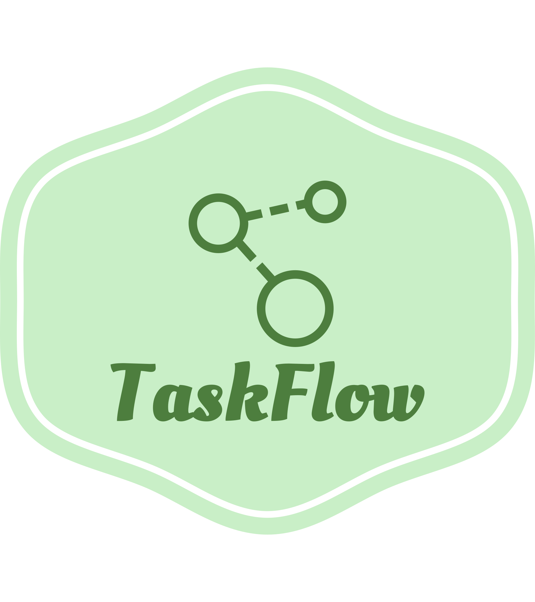

<a name="readme-top"></a>

[![Contributors][contributors-shield]][contributors-url]
[![Forks][forks-shield]][forks-url]
[![Stargazers][stars-shield]][stars-url]
[![Issues][issues-shield]][issues-url]
[![MIT License][license-shield]][license-url]
[![LinkedIn][linkedin-shield]][linkedin-url]

<!-- PROJECT LOGO -->
<br />
<div align="center">
  <a href="https://github.com/nghianm2803/taskflow-fe">
    
  </a>

<h3 align="center">Taskflow</h3>

  <p align="center">
     A platform built with React and Express to manage project.
    <br />
    <br />
    <br />
    <a href="https://taskflow-doo.netlify.app/">View Demo</a>
    ·
    <a href="https://github.com/nghianm2803/taskflow-fe/issues">Report Bug</a>
    ·
    <a href="https://github.com/nghianm2803/taskflow-fe/issues">Request Feature</a>
  </p>
</div>

<!-- TABLE OF CONTENTS -->
<details>
  <summary>Table of Contents</summary>
  <ol>
    <li>
      <a href="#about-the-project">About The Project</a>
      <ul>
        <li><a href="#built-with">Built With</a></li>
      </ul>
    </li>
    <li>
      <a href="#getting-started">Getting Started</a>
      <ul>
        <li><a href="#installation">Installation</a></li>
      </ul>
    </li>
    <li><a href="#usage">Usage</a></li>
    <li><a href="#features-and-specifications">Features and Specifications</a></li>
    <li><a href="#contact">Contact</a></li>
  </ol>
</details>

<!-- ABOUT THE PROJECT -->

## About The Project

TaskFlow is a cutting-edge web application designed to streamline task management for startup companies. With its intuitive interface, TaskFlow empowers team managers and members to effortlessly create, assign, and track tasks, ensuring everyone stays organized and focused on achieving their goals.

At the core of TaskFlow lies simplicity and efficiency. Team managers can easily create tasks, set due dates, and assign them to specific team members. TaskFlow provides a centralized platform where team members can access their assigned tasks, update their progress, and communicate seamlessly, fostering collaboration and enhancing productivity.

TaskFlow's comprehensive features enable users to break down complex projects into manageable subtasks, set priorities, and track deadlines. Real-time notifications keep everyone informed about task updates, ensuring smooth communication within the team.

With TaskFlow, managing tasks becomes a breeze. Its user-friendly interface requires no extensive training, allowing teams to adapt quickly and focus on what truly matters—delivering outstanding results. By organizing and prioritizing tasks effectively, TaskFlow helps teams meet deadlines, optimize resources, and achieve greater success.

<p align="right">(<a href="#readme-top">back to top</a>)</p>

### Built With

##### Frontend:

[](https://reactjs.org/)
[](https://material-ui.com/)
[](https://reactrouter.com/)

##### Backend:

[](https://nodejs.org/)
[](https://expressjs.com/)
[](https://mongodb.com/)

##### Third party:

[](https://app.mailgun.com/)


## Getting Started

### Installation

1. Clone the repo

   ```sh
   git clone https://github.com/nghianm2803/taskflow-fe.git
   ```

## Client

1. Install NPM packages
   ```sh
   npm install
   ```
2. Make an `.env` file using this template below
   ```js
   REACT_APP_LOCAL_URL = "http://localhost:3000"
   ```
3. Run the server on your local:
   ```sh
   npm start
   ```
   
## Usage

As a manager, I can:
- Create an account and log in/ out of Taskflow
- Invite new team members to set up their account
- Create, edit or delete project
- Search project by name
- Create and add a task to a specific project
- Provide description, set priority, and deadline for each task
- View tasks of a project by name, status or priority
- Monitor task progress, and update tasks as needed
- Assign tasks to specific team members or myself
- Delete a task
- Comment on a task
- Edit or delete my comment
- View all of my tasks
- Sort all of my tasks by status, priority or deadline
- Switch light and dark theme

As a employee, I can:
- Set up an account and log in/ out of Taskflow after receive invitation link from email
- Search project by name
- View tasks of a project by name, status or priority
- Assign tasks to myself if the task doesn’t have an assignee
- Update the status of my assigned task as my progress
- Comment on a task
- Edit or delete my comment
- View all of my tasks
- Sort all of my tasks by status, priority or deadline
- Switch light and dark theme

<p align="right">(<a href="#readme-top">back to top</a>)</p>

<!-- ROADMAP -->

### Features and Specifications

User Authentication:

- Manager can create an account and log in/ out of the manager’s app
- Team members cannot register by themselves, but need manager’s email invitation to set up their account.
- After initial setup, team members can login/out of the app using their credentials

Users:

- A User can update their profile avatar, name

Projects:

- Manager and emloyee can see list of projects
- Manager and emloyee can see a single project
- Manager can create, update or delete a project

Tasks:

- Manager and employee can see all tasks of a project
- Manager and employee can see a single task of a project
- Manager and employee can see all their tasks
- Manager can create, update or delete a task
- Manager can add a task to project
- Manager can assign a task to an employee or them
- Employee can assign task to themselves if the created task doesn’t have an assignee
- Employee can update the status of their assigned task as they progress

Comments
- User can see a list of comments on a task
- User can write a comment on a task
- User can update their comment
- User can delete their comment

<p align="right">(<a href="#readme-top">back to top</a>)</p>


## API Endpoints

### Auth APIs

```
@route POST auth/login
@description Login with email and password
@body { email, password }
@access public
```

```
@route POST /auth/setup-account
@description Employee setup account to joins the team with the invitation link
@body { email, password, role }
@access Public
```

## Users APIs

```
@route POST /users
@description Register new user
@body { name, email, password }
@access public
```

```
@route GET /users/me
@description get user informations
@body 
@access Login required
```

```
@route PUT /users/:id
@description Update user profile
@body
@access Login required
```

### Project APIs

```
@route GET /projects
@description view all projects
@body 
@access Login required
```

```
@route GET /projects/:projectId
@description get detail of single project
@body 
@access Login required
```

```
@route POST /project
@description Manager create a new project
@body 
@access Manager
```

```
@route PUT /projects/:projectId
@description Manager update a project
@body 
@access Manager
```

```
@route DELETE /projects/:projectId
@description Manager remove a project
@body 
@access Manager
```

```
@route PUT /projects/:projectId/tasks/:taskId
@description Add task to a project
@body 
@access Manager
```


## Tasks APIs

```
@route GET /tasks
@description Get all tasks
@access Login
```

```
@route GET /mytasks
@description Get all tasks of current user logged-in
@access Login
```

```
@route GET /tasks/:taskId
@description Get a single task by id
@access Login
```

```
@route POST api/tasks
@description Create a new task
@body
@access Manager
```

```
@route PUT /tasks/:taskId
@description Update a task by id
@body
@access Manager
```

```
@route DELETE /tasks/:taskId
@description Delete a task by id
@access Manager
```

```
@route PUT api/tasks/:taskId/users/:userId
@description Assign or unassign a task to a user
@body
@access Login
@requiredBody: userId
```

```
@route PUT api/tasks/:taskId/projects/:projectId
@description Add or remove a task to project
@access Login
```
```
@route GET /tasks/:taskId/comments
@description Get comments of a task
@access Login required
```

## Comments APIs

```
@route POST /comments
@description Create a new comment
@body 
@access Login required
```

```
@route PUT /comments/:commentId
@description Update a comment
@body 
@access Login required
```

```
@route DELETE /comments/:commentId
@description Delete a comment
@access Login required
```

<!-- CONTACT -->

## Contact

Nguyen Minh Nghia - [@LinkedIn](https://www.linkedin.com/in/nghianm2803) - nghianm2803@gmail.com

Project Link: [https://github.com/nghianm2803/taskflow-fe](https://github.com/nghianm2803/taskflow-fe)

<p align="right">(<a href="#readme-top">back to top</a>)</p>

<!-- MARKDOWN LINKS & IMAGES -->
<!-- https://www.markdownguide.org/basic-syntax/#reference-style-links -->

[contributors-shield]: https://img.shields.io/github/contributors/nghianm2803/taskflow-be.svg?style=for-the-badge
[contributors-url]: https://github.com/nghianm2803/taskflow-be/graphs/contributors
[forks-shield]: https://img.shields.io/github/forks/nghianm2803/taskflow-be.svg?style=for-the-badge
[forks-url]: https://github.com/nghianm2803/taskflow-be/network/members
[stars-shield]: https://img.shields.io/github/stars/nghianm2803/taskflow-be.svg?style=for-the-badge
[stars-url]: https://github.com/nghianm2803/taskflow-be/stargazers
[issues-shield]: https://img.shields.io/github/issues/nghianm2803/taskflow-be.svg?style=for-the-badge
[issues-url]: https://github.com/nghianm2803/taskflow-be/issues
[license-shield]: https://img.shields.io/github/license/nghianm2803/taskflow-be.svg?style=for-the-badge
[license-url]: https://github.com/nghianm2803/taskflow-be/blob/master/LICENSE.txt
[linkedin-shield]: https://img.shields.io/badge/-LinkedIn-black.svg?style=for-the-badge&logo=linkedin&colorB=555
[linkedin-url]: https://www.linkedin.com/in/nghianm2803
[React.js]: https://img.shields.io/badge/React-20232A?style=for-the-badge&logo=react&logoColor=61DAFB
[React-url]: https://reactjs.org/
[Node.js]: https://img.shields.io/badge/nodejs-20232A?style=for-the-badge&logo=node.js
[Node-url]: https://nodejs.org/
[Mailgun.com]: https://img.shields.io/badge/Mailgun-20232A?style=for-the-badge&logo=mailgun
[Mailgun-url]: https://app.mailgun.com
[MongoDb.com]: https://img.shields.io/badge/mongodb-20232A?style=for-the-badge&logo=mongodb
[MongoDb-url]: https://mongodb.com
